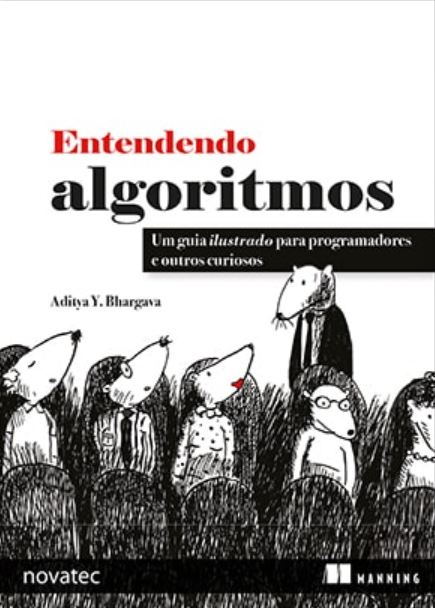

# 📖 Clube do Livro Técnico

Repositório oficial do Clube do Livro Técnico da Berolab! Este espaço é dedicado à organização das nossas leituras, discussões, anotações e ao registro do nosso progresso.

  

### **Próxima Reunião:** `03/11/2025 às 19h - Capítulo 7`

## 📚 Leitura Atual

- **Livro:** `Entendendo Algoritmos: Um Guia Ilustrado Para Programadores e Outros Curiosos`
- **Autor:** `Aditya Y. Bhargava`
- **Período:** `Data de Início: 13/10/2025`
- **Capa:**

  

## ⚙️ Como Funciona

- **Frequência:** Realizamos encontros **quinzenais** para discutir os capítulos designados.
- **Comunicação:** Nossa principal plataforma de comunicação é o fórum [**Clube do Livro Técnico no Discord**](https://discord.com/channels/1370535949313773620/1422596473991991317).
- **Discussões:** As reuniões ocorrem em um canal de voz da comunidade Berolab no Discord.
- **Dinâmica:** Os integrantes devem ter ler o conteúdo especificado para a reunião. (Se você não tiver lido, pode ir para a reunião também, mas o seu aproveitamento do Clube será melhor se tiver lido).
- **Duração do encontro:** de uma a duas horas.
- **Este Repositório:** Usamos este espaço para:
  - Divulgar o livro atual e o cronograma de leitura.
  - Manter um histórico de livros já lidos.
  - Compartilhar anotações e resumos (opcional).

## 🚀 Como Participar

O clube está sempre aberto a novos membros da Berolab.

Para se juntar a nós, apenas leia os capítulos do próximo encontro e apareça na call no Discord. 😉

**[➡️ Entre no nosso Discord](https://discord.com/channels/1370535949313773620/1422596473991991317)**
